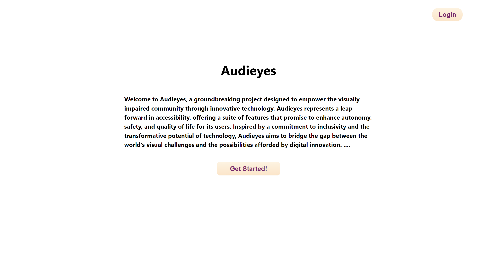
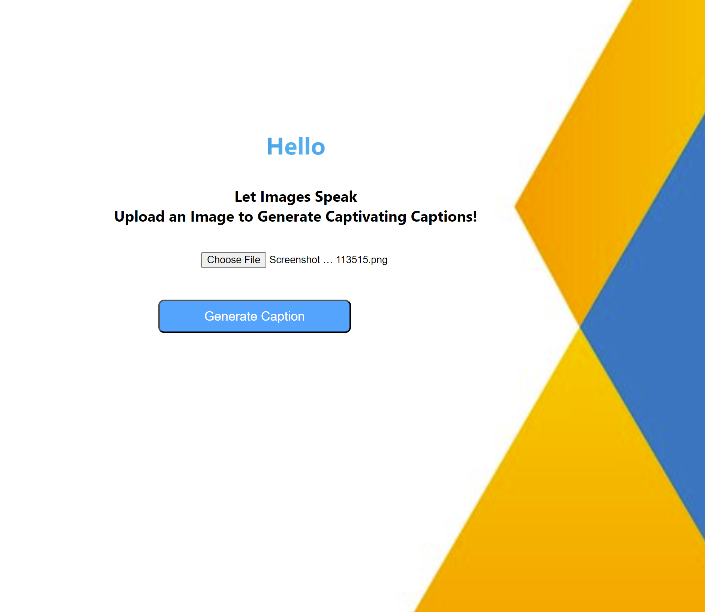
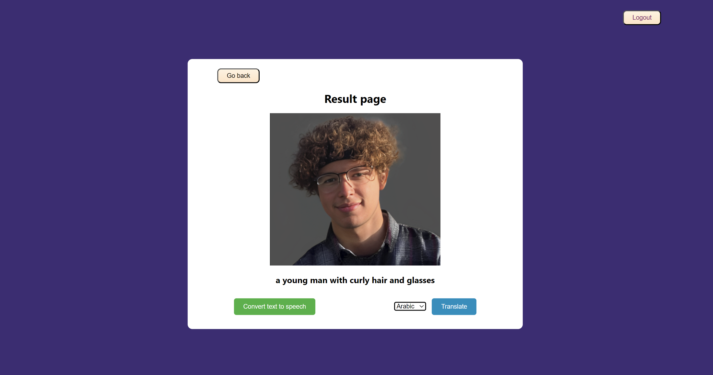
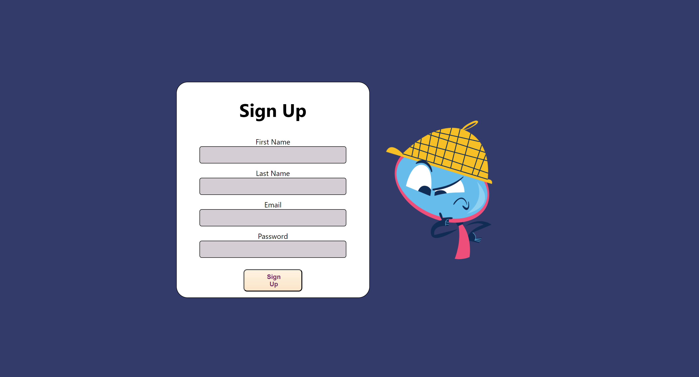

# image_caption_react_app

An Image captioning web application combines the power of React.js for front-end, Flask and Node.js for back-end, utilizing the MERN stack. Users can upload images and instantly receive automatic captions. Authenticated users have access to extra features like translating captions and text-to-speech functionality.

# Home Page



# Upload page



# Result Page



# Login Page


# Signup page



## How to Run the Project

Follow these steps to run the project on your local machine:

1. **Frontend (React):**

    - Open a terminal (Terminal-1).
    - Navigate to the 'frontend' directory using 'cd frontend/'.
    - Run the following command to start the React development server:
        ```bash
        npm install
        npm run start
        ```

2. **Backend (Flask):**

    - Open another terminal (Terminal-2).
    - Navigate to the 'server' directory using 'cd server/'.
    - Run the following command to start the Flask server:
        ```bash
        python app.py
        ```

3. **MongoDB Setup (Optional):**

    - If you want to use the login/signup, text-to-speech, and translation features, you'll need to set up MongoDB.
    - Open a third terminal (Terminal-3).
    - Navigate to the 'backend' directory using 'cd backend/'.
    - Start the Node.js server:
        ```bash
        node app.js
        ```
    - Open a fourth terminal (Terminal-4).
    - Start the MongoDB server:
        ```bash
        mongod
        ```
    - Open a fifth terminal (Terminal-5).
        ```bash
        mongo
        ```

4. **Access the Application:**
    - Open your web browser and go to [http://localhost:3000](http://localhost:3000).
