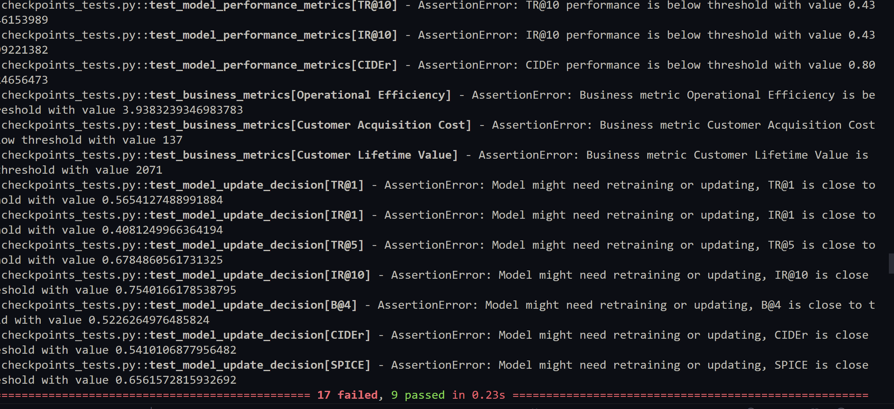
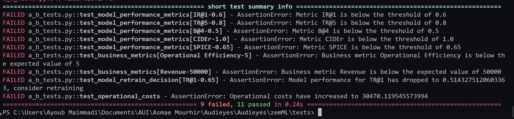
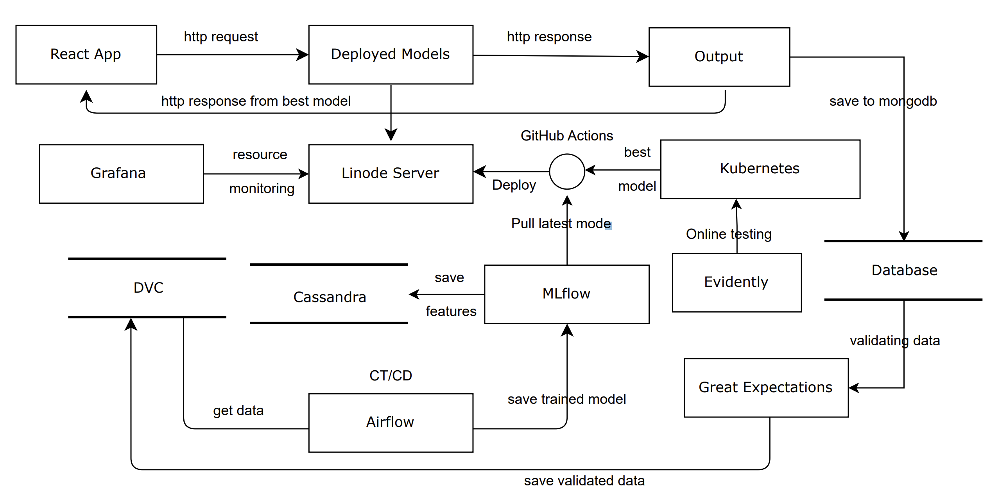
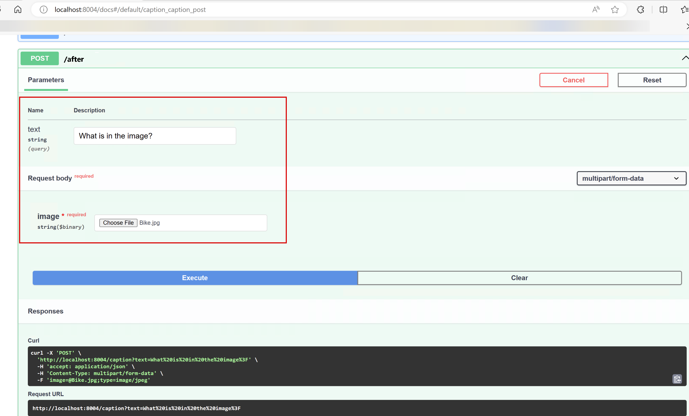
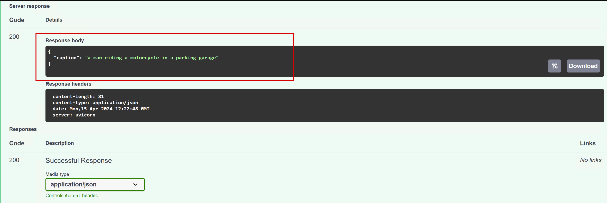
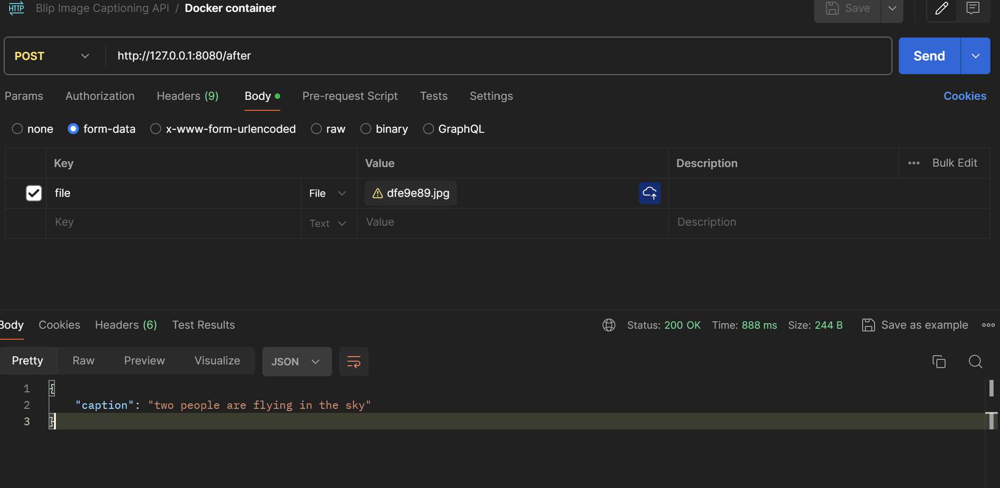
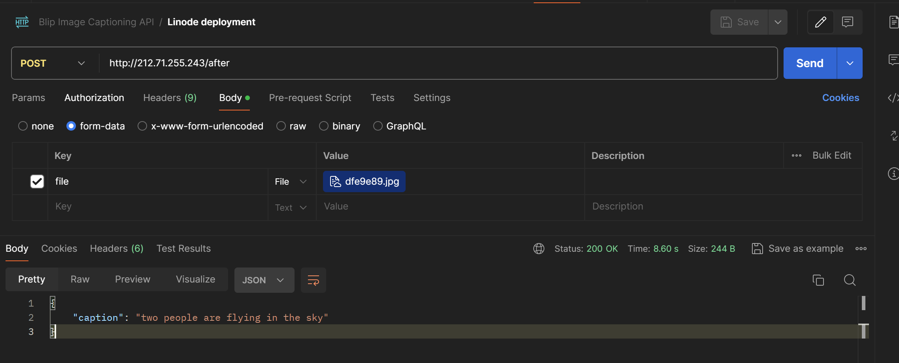
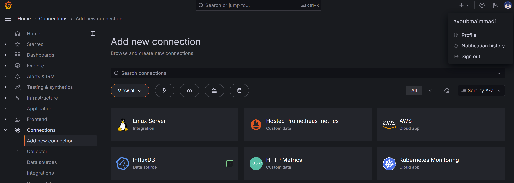

# Audieyes

# Table of Contents

1. [Introduction](#introduction)
2. [Problem Statement](#problem-statement)
3. [Objectives](#objectives)
4. [Features and Functionality](#features-and-functionality)
    - [Environment Description](#environment-description)
    - [Object Detection](#object-detection)
5. [Exploring Image and Video Captioning with Salesforce's BLIP](#exploring-image-and-video-captioning-with-salesforces-blip)
    - [Potential for Video Captioning](#potential-for-video-captioning)
6. [Business Case](#business-case)
    - [Business Metrics](#business-metrics)
7. [Business Value of Using ML](#business-value-of-using-ml)
8. [Feasibility and Baseline Specification](#feasibility-and-baseline-specification)
    - [Feasibility](#feasibility)
9. [Architectural Archetypes for Vision Captioning](#architectural-archetypes-for-vision-captioning)
    - [Human-in-the-Loop (HITL) for Enhanced Accuracy](#human-in-the-loop-hitl-for-enhanced-accuracy)
    - [Privacy-First Design in Image Processing](#privacy-first-design-in-image-processing)
    - [Autonomous Real-Time Captioning](#autonomous-real-time-captioning)
    - [Integration with Broader Ecosystems for Comprehensive Support](#integration-with-broader-ecosystems-for-comprehensive-support)
10. [BLIP: Bootstrapped Language Image Pretraining](#blip-bootstrapped-language-image-pretraining)
    - [Model Card](#model-card)
    - [Example of Input-Output Interaction](#example-of-input-output-interaction)
    - [Data Utilization in BLIP](#data-utilization-in-blip)
        - [Data Sources](#data-sources)
11. [System Development Guidelines](#system-development-guidelines)
    - [Experiment & Metadata Tracking with MLFlow](#experiment--metadata-tracking-with-mlflow)
        - [Flexibility and Agnosticism](#flexibility-and-agnosticism)
        - [Experiment Tracking and Model Versioning](#experiment-tracking-and-model-versioning)
        - [Ease of Use and Learning Curve](#ease-of-use-and-learning-curve)
        - [Scalability for Small to Medium-scale Deployments](#scalability-for-small-to-medium-scale-deployments)
        - [Community and Ecosystem Support](#community-and-ecosystem-support)
    - [Project Workflow](#project-workflow)
        - [Project Planning and Setup](#project-planning-and-setup)
        - [Data Management](#data-management)
        - [Model Development](#model-development)
        - [Model Training](#model-training)
        - [Model Evaluation](#model-evaluation)
        - [Model Deployment](#model-deployment)
        - [Monitoring and Maintenance](#monitoring-and-maintenance)
        - [Documentation and Collaboration](#documentation-and-collaboration)
        - [Security and Compliance](#security-and-compliance)
12. [Milestone 3: AI System Development (2/3)](#milestone-3-ai-system-development-23)
13. [Milestone 4: ML pipeline development and testing](#milestone-4-ml-pipeline-development-and-testing)
    - [1- Goal: ML Pipeline Development and Testing using ZenML](#1--goal-ml-pipeline-development-and-testing-using-zenml)
        - [Key Components of the ML Pipeline](#key-components-of-the-ml-pipeline)
    - [2 - Behavioural model tests](#2---behavioural-model-tests)
14. [Milestone 5: Model Deployment](#milestone-5-model-deployment)
    - [1- ML system architecture](#1--ml-system-architecture)
    - [2- Packaging and containerization](#2--packaging-and-containerization)
    - [3- ML service deployment, and Model serving](#3--ml-service-deployment-and-model-serving)
    - [4- Fron-end client](#4--fron-end-client)
    - [4- Fron-end client](#4--fron-end-client)
15. [API Documentation](#api-documentation)
16. [Milestone 7: Monitoring and continual learning](#milestone-7-monitoring-and-continual-learning)

## Introduction

Welcome to Audieyes, a groundbreaking project designed to empower the visually impaired community through innovative technology. Audieyes represents a leap forward in accessibility, offering a suite of features that promise to enhance autonomy, safety, and quality of life for its users. Inspired by a commitment to inclusivity and the transformative potential of technology, Audieyes aims to bridge the gap between the world's visual challenges and the possibilities afforded by digital innovation.

## Problem Statement

Despite significant advancements in technology, the visually impaired community often encounters barriers to accessibility and independence. From challenges in identifying clothing and colors to navigating unfamiliar environments and accessing printed materials, the need for comprehensive, user-friendly solutions is evident. Audieyes seeks to address these challenges head-on, leveraging cutting-edge technology to provide practical, empowering solutions.

## Objectives

Audieyes is guided by a mission to redefine the boundaries of accessibility for the visually impaired. Our objectives include:

-   Empowering users through enhanced accessibility features.
-   Fostering innovation and collaboration in the development of assistive technologies.
-   Making a tangible impact on the lives of users by improving independence and safety.
-   Ensuring the sustainability and scalability of the solutions we develop.

## Features and Functionality

Audieyes introduces a range of innovative features designed to meet the diverse needs of its users:

-   **Environment Description**: Offers detailed descriptions of surroundings, enhancing understanding and navigation in unfamiliar environments, or when needing to admire scenes or artwork etc.
-   **Object Detection**: Utilizes advanced image recognition to help users identify objects and their attributes with speed and accuracy.

## Exploring Image and Video Captioning with Salesforce's BLIP

Audieyes is exploring the integration of Salesforce's BLIP model for image captioning to further enhance its service offerings. The BLIP model, available on Huggingface ([Salesforce/blip-image-captioning-large](https://huggingface.co/Salesforce/blip-image-captioning-large)), is designed specifically for generating descriptive text for images, making it an ideal solution for providing real-time, accurate descriptions of the environment to Audieyes users.

### Potential for Video Captioning

While BLIP is primarily focused on image captioning, its underlying technologies and methodologies present a promising foundation for extending to video captioning. By analyzing video frames as a sequence of images, it's conceivable to adapt BLIP for dynamic environments, offering a continuous, contextual narrative that could significantly benefit the visually impaired community. This extension would involve additional research and development efforts to handle the temporal aspects and continuity present in videos.

## Business Case

The Audieyes project presents a compelling business case by addressing a critical and underserved market: the accessibility needs of the visually impaired community. Through innovation and user-centric design, Audieyes not only fulfills a social imperative but also taps into a market with significant growth potential.

### Business Metrics

-   **Market Expansion**: By adopting Audieyes, businesses can tap into the largely underserved market of the visually impaired, opening new avenues for growth and customer acquisition. This technology enables companies to cater to a wider audience, ensuring their products and services are accessible to all, thereby expanding their market reach.

-   **Brand Differentiation**: Integration of Audieyes technology allows businesses to distinguish themselves in a competitive marketplace. Offering accessible solutions not only demonstrates corporate social responsibility but also positions a brand as inclusive and forward-thinking, appealing to a broader consumer base, including those who value inclusivity.

-   **Operational Efficiency**: By utilizing Audieyes' AI-driven features, businesses can streamline operations, reducing the need for manual assistance and customer support for the visually impaired. This efficiency can lead to significant cost savings and improved service delivery, contributing to overall profitability.

-   **Customer Loyalty and Retention**: Providing accessible solutions like Audieyes enhances user experience for the visually impaired, fostering a loyal customer base. Satisfied users are more likely to return and recommend the business to others, driving repeat business and word-of-mouth marketing.

-   **Data-Driven Insights for Product Development**: Feedback and usage data from Audieyes can provide valuable insights into the needs and preferences of the visually impaired community. Businesses can leverage this data to innovate and develop new products or services, further driving growth and profitability.

## Business Value of Using ML

Leveraging machine learning, Audieyes enhances its core functionalities, offering personalized experiences and improving the accuracy and efficiency of its features. ML drives the project's innovative edge, from image recognition to predictive analytics for navigation.

## Feasibility and Baseline Specification

### Feasibility

The feasibility of Audieyes is supported by advancements in AI, machine learning, and sensor technologies, making its ambitious goals within reach.

## Architectural Archetypes for Vision Captioning

-   **Human-in-the-Loop (HITL) for Enhanced Accuracy**: In the context of vision captioning, HITL architecture ensures that human feedback is integral to the continuous improvement of caption accuracy and relevance. Meaning that users can request additional details to the generated captions, which are then used to refine the underlying AI models, ensuring that the system evolves to meet the diverse needs.

-   **Privacy-First Design in Image Processing**: Given the sensitive nature of visual data, Audieyes emphasizes a privacy-first approach in its vision captioning feature. This means implementing stringent data protection measures, encrypting user data, and ensuring that image processing complies with privacy laws and ethical standards.

-   **Autonomous Real-Time Captioning**: Leveraging the power of AI and ML, the vision captioning functionality operates autonomously, providing real-time descriptions of images or video content. This autonomous system is capable of understanding and describing complex scenes, objects, and text in images, offering users immediate insights into their surroundings or any visual content they encounter.

-   **Integration with Broader Ecosystems for Comprehensive Support**: Recognizing the diverse needs of visually impaired users, the vision captioning system is designed to integrate seamlessly with other components of the Audieyes ecosystem, including navigation aids, object recognition, and text-to-speech services. This holistic approach ensures that users have access to a comprehensive suite of tools that enhance their autonomy and quality of life.

# BLIP: Bootstrapped Language Image Pretraining

## Model Card

BLIP is designed for learning visual representations by pretraining on a large-scale dataset combining images and textual annotations. This approach allows the model to understand complex visual concepts and their associations with textual descriptions, enhancing its performance in tasks such as image captioning, visual question answering, and more. You can find the model card on Huggingface ([here](https://huggingface.co/Salesforce/blip-image-captioning-large)). The research paper for BLIP can be found here: [BLIP Research Paper](/Audieyes/references/BLIP.pdf)

## Example of Input-Output Interaction

### Input


### Output

BLIP's response : "two cats laying on a pink blanket with remote controls on the back."

Keep in mind that the model's responses can be configured to provide more or less detailed descriptions based on user preferences and requirements with the modification of the temperature parameter.

### Input


### Output

BLIP's response : "there is a stuffed animal sitting in front of a computer"

## Data Utilization in BLIP

The BLIP model (Bootstrapped Language Image Pre-training) leverages a comprehensive dataset amalgamation to train its sophisticated AI systems. It incorporates vast amounts of image-text pairs to understand and generate meaningful interactions between visual content and natural language. This model stands out for its use of a dataset that combines elements from publicly available resources, ensuring a broad coverage of concepts, objects, and scenarios.

### Data Sources

BLIP's training involves diverse data sources, including but not limited to:

-   **Public Datasets:** Utilizes widely recognized datasets in the AI community, ensuring a rich variety of visual and textual content. Datasets include but are not limited to: [COCO](https://storage.googleapis.com/sfr-vision-language-research/datasets/coco_karpathy_train.json), [flickr30k](https://storage.googleapis.com/sfr-vision-language-research/datasets/flickr30k_test.json), [vqa](https://storage.googleapis.com/sfr-vision-language-research/datasets/vqa_train.json), and [nlvr](https://storage.googleapis.com/sfr-vision-language-research/datasets/nlvr_train.json).

data example:

```json
    [{
        "image": "flickr30k-images/1007129816.jpg",
        "caption": [
            "The man with pierced ears is wearing glasses and an orange hat.",
            "A man with glasses is wearing a beer can crocheted hat.",
            "A man with gauges and glasses is wearing a Blitz hat.",
            "A man in an orange hat starring at something.",
            "A man wears an orange hat and glasses."
        ]
        },
        {
        "image": "flickr30k-images/1009434119.jpg",
        "caption": [
            "A black and white dog is running in a grassy garden surrounded by a white fence.",
            "A Boston Terrier is running on lush green grass in front of a white fence.",
            "A black and white dog is running through the grass.",
            "A dog runs on the green grass near a wooden fence.",
            "A Boston terrier is running in the grass."
        ]
        },
        {
        "image": "flickr30k-images/101362133.jpg",
        "caption": [
            "A young female student performing a downward kick to break a board held by her Karate instructor.",
            "Girl about to kick a piece of wood in half while karate instructor holds it",
            "A girl kicking a stick that a man is holding in tae kwon do class.",
            "A girl in karate uniform breaking a stick with a front kick.",
            "A girl breaking boards by using karate."
        ]
    }],
```

# System Development Guidelines

## Experiment & Metadata Tracking with MLFlow

### Flexibility and Agnosticism

-   **MLflow** allows you to work with various machine learning libraries, not just TensorFlow. This flexibility enables seamless integration of models from different frameworks, essential for combining image captioning and temporal modeling in our project.

### Experiment Tracking and Model Versioning

-   **MLflow** offers robust capabilities for experiment tracking and model versioning. Logging parameters, metrics, and artifacts for each experiment is streamlined, ensuring reproducibility and facilitating collaboration.

### Ease of Use and Learning Curve

-   **MLflow**'s simplicity and user-friendly interface make it suitable for teams with varying levels of expertise, streamlining the development and deployment process without a steep learning curve.

### Scalability for Small to Medium-scale Deployments

-   While TFX is designed for scalable, production-grade ML pipelines, **MLflow**'s lightweight nature is ideal for small to medium-scale deployments, particularly for projects deploying video captioning on resource-constrained devices like tiny cameras.

### Community and Ecosystem Support

-   With a growing community and support for integrations with popular machine learning libraries and platforms, **MLflow**'s capabilities can be extended through community-contributed plugins and extensions.

## Project Workflow

### Project Planning and Setup

-   **To do:** We will use agile methodologies for project planning and management, ensuring flexibility and adaptability to changing requirements. Using Jira for task management and sprint planning will help keep the project on track.

### Data Management

-   **To do:** We will use DVC (Data Version Control) for versioning and managing large datasets, ensuring reproducibility and traceability of data used in model training. This will be essential for maintaining data integrity and tracking changes.

### Model Development

-   **To do:** We will use MLflow for experiment tracking and model versioning, enabling us to compare different model iterations and track performance metrics. This will help to ensure that we have the best model for our use case.

### Model Training

-   **To do:** We will re-train the model using new data to improve its performance and adapt it to specific use cases. This will involve fine-tuning the model and using transfer learning to leverage pre-trained models for faster convergence.

### Model Evaluation

-   **To do:** We will use MLFlow to track model performance and evaluate its accuracy, precision, recall, and F1 score (combination btw precision and recall). This will help us understand how well the model is performing and identify areas for improvement.

### Model Deployment

-   **To do:** We will use opt for TinyML for deploying the model on resource-constrained devices, ensuring that it can run efficiently on tiny edge devices. This will enable real-time image/video captioning on devices like tiny cameras, enhancing accessibility for visually impaired users.

### Monitoring and Maintenance

-   **To do:** We will use MLflow to monitor model performance and track any drift in model accuracy over time. This will help us identify when the model needs retraining and ensure that it continues to perform optimally.

### Documentation and Collaboration

-   **To do:** We will generate documentation using Sphinx and Read the Docs, ensuring that the project is well-documented from the explainability perspective for potential users and contributors.

### Security and Compliance

-   **To do:** We will ensure that the project adheres to data privacy and security standards, implementing encryption and access controls to protect user data.

# Milestone 3: AI System Development (2/3)

## Goal: Data Preparation and Validation

In this milestone, we focus on the critical stage of data preparation and validation, ensuring the quality and integrity of the data that feeds into Audieyes' AI systems. This process is foundational to developing robust and reliable AI models capable of fulfilling our mission to enhance accessibility for the visually impaired community.

### Data Validation and Verification

**Library Used: Great Expectations** View the code [here](/Audieyes/zemML/pipelines/validation/greate_expectation_validation.ipynb)

For data validation and verification, we have chosen Great Expectations, a powerful tool that allows for comprehensive data testing, documentation, and profiling. This library stands out for its ability to adapt to various data forms and its extensive community support. The decision to utilize Great Expectations is driven by its flexibility and the non-TensorFlow-centric nature of some of our data processing tasks.

**Implementation Strategy**:

1. **Schema Inference and Validation**: We will use Great Expectations to automatically infer the data schema, ensuring that our datasets adhere to expected formats and types. This step is crucial for establishing a strong foundation for data quality.
2. **Data Profiling and Anomaly Detection**: Through statistical analysis, we will profile our datasets to understand their characteristics and detect any anomalies or outliers that could impact model performance.

3. **Anomaly Resolution and Schema Revision**: Identified anomalies will be addressed through preprocessing steps or schema adjustments, ensuring our data is accurately represented and reliable.

### Data Pipeline Setup

**Feature Store Integration: Apache Cassandra**

For managing and serving features to our AI models, we have chosen Apache Cassandra as our feature store. This decision is driven by Cassandra's scalability, fault tolerance, and high availability, making it an ideal choice for handling large volumes of feature data.

1. **Preprocessing and Feature Engineering**: We will preprocess and engineer features from our raw data, transforming them into a format suitable for ingestion into the feature store.

2. **Feature Management**: Features will be stored in Apache Cassandra, allowing for efficient retrieval and serving to our AI models.

3. **Integration with ML Pipeline**: The feature store will be integrated into our ML pipeline, ensuring that our models have access to the latest feature data for training and inference.

# Milestone 4: ML pipeline development and testing

## 1- Goal: ML Pipeline Development and Testing using ZenML

I have used ZenML for developing and testing the ML pipeline. ZenML is an open-source MLOps framework that simplifies the end-to-end machine learning lifecycle, from data ingestion to model deployment. It provides a structured and scalable approach to ML pipeline development, enabling reproducibility, collaboration, and automation.

### Key Components of the ML Pipeline

0. **Data Validation**: the pipeline validates the raw data to ensure its quality and integrity before ingestion. Check the code [here](/Audieyes/zemML/pipelines/validation/greate_expectation_validation.ipynb)

1. **Data Ingestion**: the pipeline ingests raw data from various json sources, including image and text datasets, and preprocesses them for model training. Check the code [here](/Audieyes/zemML/pipelines/src/data/__init__.py)

2. **Data Splitting**: the pipeline splits the preprocessed data into training and validation sets, ensuring that the model is trained on a representative sample of the data. check at line 59 [here](/Audieyes/zemML/pipelines/src/data/coco_karpathy_dataset.py)

3. **Model checkpoint Training**: the pipeline trains the image captioning model using the preprocessed data, leveraging the BLIP model for image captioning. check an example checkpoint [here](/Audieyes/zemML/pipelines/src/models/blip_nlvr.py)

4. **Model Evaluation**: the pipeline evaluates the trained model on the validation set, assessing its performance and identifying areas for improvement. check the evaluation example at line 39 [here](/Audieyes/zemML/pipelines/src/data/__init__.py)

5. **Model Deployment usign CI/CD**: the pipeline deploys the trained model as a service, enabling real-time image captioning for users. check the deployment code [here](/.github/workflows/deployment.yaml)

## 2 - Behavioural model tests

I have used GitHub Actions for running behavioural model tests. These tests validate the functionality and performance of the image captioning model, ensuring that it meets the specified requirements and quality standards. The tests are executed automatically whenever changes are made to the model codebase, providing continuous feedback on the model's behavior and performance.

1. **Model checkpoints Test**: the test checks that the model checkpoints are generated correctly and contain the expected parameters and metadata. check the test [here](/Audieyes/zemML/tests/checkpoints_tests.py)

#### example of a test result:



2. **Business Metrics Test**: the test evaluates the model's performance against predefined business metrics, such as operational efficiency, revenue and more. check the test [here](/Audieyes/zemML/tests/metrics_tests.py)

#### example of a test result:



# Milestone 5: Model Deployment

## 1- ML system architecture



## 2- Packaging and containerization

I have used Docker for packaging and containerizing the image captioning model. Docker provides a lightweight, portable container that encapsulates the model and its dependencies, ensuring consistent behavior across different environments. The containerized model can be easily deployed on various platforms, making it accessible to a wide range of users. View details [Docker_Containerization](/Audieyes/docker/README.md)

## 3- ML service deployment, and Model serving

I have used Docker for packaging and containerization, FastAPI for ML service deployment, and Hugging Face Transformers for model serving. This architecture ensures that the image captioning model is deployed as a scalable and efficient service, accessible via APIs for real-time inference. [Docker_Deployment](/Audieyes/app/README.md)

### API Input Using Swagger UI



### API Response



## 4- Fron-end client

I have used React for developing the front-end client, enabling users to interact with the image captioning model through an intuitive and user-friendly interface. The client communicates with the ML service via APIs, providing real-time captioning for images uploaded by users. [React_Frontend_Details](/Audieyes/app/react_app/README.md)


# API Documentation

### Local model


### Docker contained model




### Linode deployed model




# Milestone 7: Monitoring and continual learning

## Monitoring and continual learning

I have used Grafana and Prometheus for monitoring the deployed model, ensuring that it performs optimally and meets the specified service level objectives. This monitoring setup provides real-time insights into the model's behavior, performance, and resource utilization, enabling proactive maintenance and optimization.



### Installation and Configuration

1. **Prometheus**: I have installed and configured Prometheus to collect metrics from the ML service and store them for monitoring and analysis. Prometheus scrapes metrics from the ML service endpoints and stores them in a time-series database for visualization.

2. **Grafana**: I have set up Grafana to visualize the metrics collected by Prometheus, providing real-time dashboards and alerts for monitoring the model's performance. Grafana enables users to track key metrics, identify trends, and troubleshoot issues proactively.

```bash
sudo apt-get install -y software-properties-common
sudo add-apt-repository "deb https://packages.grafana.com/oss/deb stable main"
wget -q -O - https://packages.grafana.com/gpg.key | sudo apt-key add -
sudo apt-get update
sudo apt-get install grafana
```

### Using Docker

```bash
docker pull grafana/grafana
docker run -d -p 3000:3000 grafana/grafana
```

### Starting Grafana

```bash
sudo systemctl start grafana-server
sudo systemctl enable grafana-server
```

## Model performance monitoring

I have used Evidently for monitoring the performance of the image captioning model, ensuring that it maintains high accuracy and reliability over time. Evidently provides comprehensive insights into the model's behavior, enabling users to track key metrics, detect anomalies, and identify areas for improvement.

## Continual learning: CT/CD

I have used Airflow triggers for continual learning, ensuring that the image captioning model is updated and retrained regularly to adapt to changing data and user requirements. Airflow triggers automate the model retraining process, ensuring that the model remains up-to-date and performs optimally.

## Online testing (A/B testing, Bandit)

I have used Seldon-core for online testing, including A/B testing and Bandit algorithms, to evaluate the performance of the image captioning model in real-time. Seldon-core enables users to deploy multiple model versions simultaneously, compare their performance, and optimize model selection based on user feedback and metrics.

## Orchestration

I have used Kubernetes for orchestration, ensuring that the image captioning model is deployed and managed efficiently across different environments. Kubernetes provides a scalable and resilient platform for running containerized applications, enabling users to deploy, scale, and monitor the model with ease.
